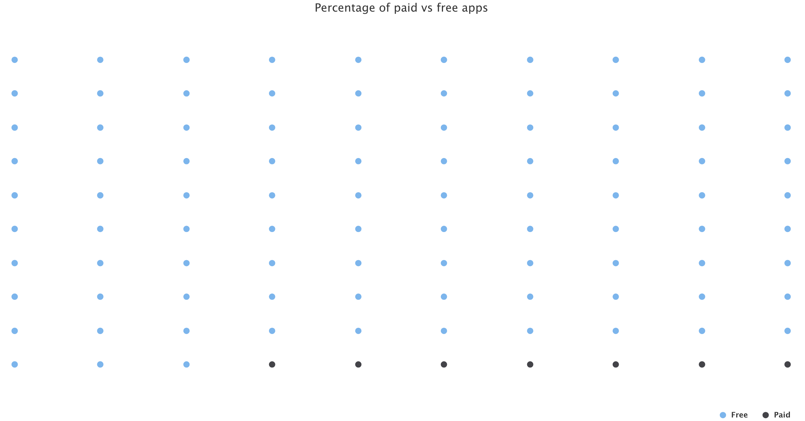

```{r setup, include=FALSE, echo=FALSE}
knitr::opts_chunk$set(echo = TRUE)
library(tidyverse)
library(highcharter)
library(lubridate)
library(stringr)
library(xts)
library(lme4)
library(lattice)
library(gridExtra)
library(arm)
library(ggpubr)
library(visreg)
data<-read.csv("googleplaystore.csv")
```
# Abstract

Google Play is the official app store of Android, Google's mobile platform. It allows people to view applications and load of content before downloading anything on their devices. The Play Store apps data has enormous potential to drive app-making businesses to success. In this report, I explored this question -- what factors might influence the number of users' reviews and how they drive to future app-making businesses probably? Based on setting up a multilevel regression model, I discovered several factors that may make sense, making some suggestions for future app-making businesses at the same time. Additionally, it indexed important information about Android apps. The model shows that the number of reviews is slightly different between categories. This report consists 4 main parts: Introduction, Method, Result and Conclusion.

# Introduction

Google Play indexes important information about Android apps, including ratings, alternative suggestions,user reviews and other descriptions of apps. It uses sophisticated modern-day techniques (like dynamic page load) using JQuery making scraping more challenging. The Play Store apps data has enormous potential to drive app-making businesses to success. Actionable insights can be drawn for developers to work on and capture the Android market! So each app has its own features and some similarities with others as well, such as the number of installs, types and the price of apps. And some features may lead the apps to be more out-standing.
  
So here I would use multilevel regression to see how different their number of reviews are between each category.Before that, I cleaned the data and added with some new columns to see which factors are more significant.

# Method

### Data Cleaning and Processing

The main data set is published on [Kaggle: Google Play Store Dataset](https://www.kaggle.com/lava18/google-play-store-apps).

Firstly I made lots of steps to data cleaning. In order to have a clear format of data, I checked the types of the data and variables and changed all factor variables to be numeric, eliminating lots of symbols (such as "M"and currency symbol) as well. 

```{r, echo=FALSE,message=FALSE,warning=FALSE}
#Change factor variables to be numeric.
data.clean<-data %>%
  mutate(
    #eliminate some characters to transform 'Installs' to numeric
    Installs = gsub("\\+", "", as.character(Installs)),
    Installs = as.numeric(gsub(",","",Installs)),
    #eliminate M to transform 'Size' to numeric
    Size = gsub("M", "", Size),
    #replace cells with 'k' to '0' since it is < 1MB
    Size = ifelse(grepl("k", Size), 0, as.numeric(Size)),
    #transform reviews to numeric
    Reviews = as.numeric(as.character(Reviews)),
    #remove currency symbol from Price, change it to numeric
    Price = as.numeric(gsub("\\$", "", as.character(Price))),
    #change 'Last Updated' to date format
    Last.Updated = mdy(Last.Updated),
    #replace "Varies with device" to NA since it is unknown
    Min.Android.Ver = gsub("Varies with device", NA, Android.Ver),
    #keep only version number to one decimal
    Min.Android.Ver = as.numeric(substr(Min.Android.Ver, start = 1, stop = 3)),
    #drop old Android version column
    Android.Ver = NULL
  ) %>%
  filter(
    # two apps had type as 0 or NA,remove them
    Type %in% c("Free", "Paid")
  )
#check duplicate records
a<-nrow(data.clean %>%
       distinct()) #The above should list 10841,so there are 485 rows duplicated.I'll remove them later.
#NA analysis
data.clean %>%
  summarise_all(
    funs(sum(is.na(.))) 
  ) %>%
  gather() %>%
  #only show columns with NA
  filter(value > 1) %>%
  arrange(-value) %>%
    hchart('column', hcaes(x = 'key', y = 'value', color = 'key')) %>%
  hc_add_theme(hc_theme_elementary()) %>%
  hc_title(text = "Columns with NA values")
  #here we have three columns with NA values.Following I will take a closer look at them.
#NA values in Size
b<-data %>%
  filter(
    Size %in% "Varies with device"
  ) %>%
  count() #From the data cleaning process,there are a total of 1695 applications with "Varies with device" which I transformed to NAs.So,that explains NAs in this column.

#NA values in 'Rating'
data.clean %>%
  filter(is.na(Rating)) %>%
  count(Installs) %>%
  arrange(-n) %>%
  hchart('column', hcaes(x = "Installs", y = "n")) %>%
  hc_add_theme(hc_theme_google()) %>%
  hc_title(text = "Installations with no rating") #Most applications without rating have very few installs,which could make sense.
#NA values in 'Minimum Android Version'
c<-data %>%
  filter(
    Android.Ver %in% "Varies with device"
  ) %>%
  count() #Same as above,with "Varies with device" label present.There were a total of 1362 applications with "Varies with device" which we transformed to NA.
```

### Description of Data

| column names      | explanation |
| :--:              | :----- |
| App               | Application name|
| Rating            | Overall user rating of the app (as when scraped) |
| Reviews           | Number of user reviews for the app (as when scraped) |
| Size              | Size of the app (as when scraped) |
| Installs          | Number of user downloads for the app (as when scraped) |
| Type              | Paid or Free|
| Content Rating    | Age group the app is targeted at-Children/Mature 21+/Adult |
| Genres            | An app can belong to multiple genres (apart from its main category) |

### EDA

Here I would like to draw some plots to see the relationship between reviews and other variables and analyze features of variables, since my question is how some factors effect the number of reviews.

```{r echo=FALSE}
knitr::opts_chunk$set(echo = TRUE,message = FALSE,
	warning = FALSE)
#Drop NAs
final.data<-na.omit(data.clean)
#Checking NAs
#apply(X=final.data, MARGIN = 2,FUN = function(col) any(is.na(col))) #There is no NAs in data frame.
#Drop duplicated rows
data1<-final.data %>%
       distinct()
#Change 'Category' into factor
data1$Category<-as.factor(data1$Category)
#Make transform of 'Installs' & 'Reviews'
log_installs<-log(data1$Installs)
log_reviews<-log(data1$Reviews)
newdata<-cbind(log_installs,log_reviews,data1)
```

```{r echo=FALSE, fig.height=4, fig.width= 10,fig.cap="The relationship between number of installs and reviews."}
#Here I only analysis those 'Type' == "Free",which has a larger proportion.
newdata<-subset(newdata, Type == "Free")
ggplot(data.frame(newdata$log_reviews,newdata$log_installs,newdata$Category))+geom_point()+
  aes(x=newdata$log_installs, y=newdata$log_reviews, color=newdata$Category)+
  stat_summary(fun = "mean", geom = "line", alpha=0.3)+
  stat_summary(fun = "mean", geom = "line", lty=2, aes(group=1),color="black")+
  ylab("log number of reviews")+xlab("log number of installs")+theme(legend.position = "none")
```

Figure 1 shows the relationship between the number of installs and reviews. But it seems like there is not too much significant relationship between these two variables, because all the lines in the plot have the similar trend by default. So I guess the variable 'log_installs' should not be included in our model.

```{r echo=FALSE, fig.height=4, fig.width=10, fig.cap="The relationship between size and the number of reviews."}
ggplot(data.frame(newdata$log_reviews,newdata$Size,newdata$Category))+geom_point()+
  aes(x=newdata$Size, y=newdata$log_reviews, color=newdata$Category)+
  stat_summary(fun = "mean", geom = "line", alpha=0.3)+
  stat_summary(fun = "mean", geom = "line", lty=2, aes(group=1),color="black")+
  ylab("log number of reviews")+xlab("Size")+theme(legend.position = "none")
```

Figure 2 shows the relationship between size and the number of reviews. Unlike the 'installs', the relationship here varies obviously between categories. There should be random intercept and random slope at the same time. For the plot on the right, I found that for some categories of apps, the number of reviews varies dramatically with the size of the application.

```{r echo=FALSE, fig.height=4, fig.width=10, fig.cap="The relationship between rating and the number of reviews." }
ggplot(data.frame(newdata$log_reviews,newdata$Rating,newdata$Category))+geom_point()+
  aes(x=newdata$Rating, y=newdata$log_reviews, color=newdata$Category)+
  stat_summary(fun = "mean", geom = "line", alpha=0.3)+
  stat_summary(fun = "mean", geom = "line", lty=2, aes(group=1),color="black")+
  ylab("log number of reviews")+xlab("Rating")+theme(legend.position = "none")
```

Figure 3 shows the relationship between rating and the number of reviews. The result is the same as the size's. The differences between categories are so significant. Also different categories have different slopes and intercepts. Therefore, I think the variables 'Size' and 'Rating' should be taken into account when I fit the model.

### Model Fitting

After deleting lost data and duplicated rows, transforming log of column 'Installs' and 'Reviews' (because I found they all have a large scale with a long tale from the histogram plots showed above), I got 7369 observations of 15 variables. But I will choose only several variables to use. Here I only analysis those 'Type' == "Free",which has a larger proportion. 

```{r, echo=FALSE,message=FALSE,warning=FALSE}
#only with intercept
model.0<-lmer(log_reviews ~ 1 + (1|Category), data = newdata)

#random intercept, fixed predictor in individual level
model.1<-lmer(log_reviews ~ Rating + Size + (1|Category), data = newdata)

#run random intercept and slope model
model.2<-lmer(log_reviews ~ Rating + Size + (1+Rating|Category) + (1+Size|Category) , data = newdata)

#anova(model.0,model.1,model.2) # choose 'model.2'
```

Considering different categories, I used multilevel model to fit the data. From the EDA part, I found that for the 'log_installs' predictor, the differences between each category was not so significant. So I did not choose 'log_installs' as one of model's predictor. Here I chose continuous variables -- 'Size' and 'Rating' as model's predictors. From EDA part above, I guessed that for 'Size' and 'Rating' predictors, it should be random intercept and random slope model. To be more convinced, I still did three different models and used anova for model selecting (choosing the one has the smallest AIC, model.2 shown as follow). 

```{r echo=FALSE, fig.height=4, fig.width=10, fig.cap="How the expected value of the y(Reviews) changes as a function of x,with all other variables held fixed." }
par(mfrow=c(1,2))
visreg(model.2,"Rating", ylab = "number of reviews")
visreg(model.2,"Size", ylab = "number of reviews")
```

To see the fixed effects below:

|                |Estimate   |Std. Error  |t value |p value |
|:---:           |:---:      |:---:       |:---:   |:---:   |
|(Intercept)     |1.42       |0.52        |2.75    |5.93e-03|
|Rating          |1.24       |0.16        |7.72    |1.20e-14|
|Size            |0.05       |0.01        |8.48    |0.00e+00|

### Model results

As we can see the results of fixed effects above, here I only take one of those categories into account. For ART_AND_DESIGN category, we can conclude this formula:

$$log(reviews)= 4.70 + 0.64\cdot Rating + 0.07\cdot Size$$

All the parameters of three predictors are all bigger than 0 (except for the parameter of 'Size' under AUTO_AND_VEHICLES category), which means they all have positive impact on number of reviews. For each 1% difference in the number of installs, the predicted difference in reviews is 0.95%. About the reason of the negative parameter of 'Size' under AUTO_AND_VEHICLES category, I think it does not have so much meaning. Because the abstract value of this parameter is almost 0. 

In addition, we can see differences between each category. Here I took three of them as example. Let's look at their parameters of these predictors as follow:

|                        |(Intercept) |Rating       |Size  |
|:---:                   |:---:       |:---:        |:---: |
|ENTERTAINMENT           |-7.25       |2.84         |0.05  |
|EVENTS                  |7.29        |0.18         |0.02  |
|MEDICAL                 |6.42        |0.27         |0.01  |

For different categories, the influence of each predictor is always not the same. For ENTERTAINMENT, I think whether people will download the app depends more on how people rate it, and because it's entertainment, people are more likely to decide whether to download a non-essential app because of the size of the device's memory. So the parameters of 'Rating' and 'Size' are bigger than other categories. For EVENTS, the parameter of 'Rating' is small, this might because these apps are mostly nonfiction apps, and people rarely rate them. And for MEDICAL, since apps in this category are essential to people's lives, the number of times people review them is less dependent on other users' ratings and the size of the app itself.

### Model Validation 

In this part, based on residual checking I discovered the normality of the model is good and there are not obvious point, which means the coefficients in the regression model would not change if a particular observation was removed from the data.
 
# Conclusion

From the estimates above, I would draw the conclusion as follow. The parameters of variables shows that "Rating" and "Size" both have a positive influence on the number of reviews. The higher level from people's rating, which means people who used this app before have more sense about it, they would like to recommend it to others, so they are willing to share their feelings on social platforms. In addition, for the "Size" factor, the larger size the app has, the more probably people will write reviews for it. By default, the reason of it is those apps with larger size may include more information and more utility features, in that case there will be more people downloading and using them. Therefore there will be more reviews of them, but the influence of size is not so significant comparing with rating.

In addition, app-making businesses should pay more attention on the creation of entertainment apps because from the distribution of number of reviews by categories, those are at the top. The more comments people make about software, the more social impact it has, and the more likely software developers are to find new ideas from reviews. By default, apps designers should explore apps that are free. Certainly,the importance of this is somewhat diminished for categories of software that people need to use in their daily lives, such as those under the medical category.

For the purpose of giving suggestions for future app-making businesses, I would like to suggest them pay more attention to people's rating factor when they create new apps. Obviously, if the app has higher rating that means people like this production more, probably they will write more reviews on it so this will attract more and more people to use it. And another suggestion is businesses could care about the app's size when they design a new production. For those apps include more utility features, people have to use them so they probably will not care about their sizes so much. But for those apps only for entertainment, if the application occupies a large amount of device memory, people will consider not downloading and using it, or have a high chance to uninstall it after downloading. Of course, there are not many comments on these software, which indicates that these software is not popular. Finally, software developers should take better advantage of the momentum of young people, who are more likely to post reviews on social platforms. The development industry should take advantage of the drive effect while doing what it wants to do to drive adoption of other applications.

\newpage
## Appendix

### More EDA

```{r echo=FALSE, fig.cap="Distribution plots for number of installs, number of reviews, size and rating"}
par(mfrow = c(2, 2))
hist(data.clean$Installs)
hist(data.clean$Reviews)
hist(data.clean$Size)
hist(data.clean$Rating)
```

```{r echo=FALSE, fig.cap="'log_reviews' vs 'log_installs'"}
ggplot(data = newdata)+
  aes(log_reviews,log_installs)+
  geom_point(aes(color = Category),alpha = 0.8)+
  labs(title="grades of installs vs number of reviews",x="log(grades of installs)",y="log(number of reviews)")+
  geom_smooth(aes(color = Category),method = "lm",se=F)+
  facet_wrap(~Content.Rating)
```

```{r echo=FALSE, fig.cap="'log_reviews' vs 'Size'"}
ggplot(data = newdata)+
  aes(log_reviews,Size)+
  geom_point(aes(color = Category),alpha = 0.8)+
  labs(title="Size vs number of reviews",x="Size)",y="log(number of reviews)")+
  geom_smooth(aes(color = Category),method = "lm",se=F)+
  facet_wrap(~Content.Rating)
```

```{r echo=FALSE, fig.cap="'log_reviews' vs 'Rating'"}
ggplot(data = newdata)+
  aes(log_reviews,Rating)+
  geom_point(aes(color = Category),alpha = 0.8)+
  labs(title="Rating vs number of reviews",x="Rating",y="log(number of reviews)")+
  geom_smooth(aes(color = Category),method = "lm",se=F)+
  facet_wrap(~Content.Rating)
```


{width=50%}
{width=50%}

{width=50%}

{width=50%}
{width=50%}
{width=50%}
{width=50%}
{width=50%}
{width=50%}
{width=50%}

```{r echo=FALSE, fig.cap="Bar chart for installs in group"}
#divide the range of 'Installs' by groups of 10k
installs<-data.clean %>%
  group_by(
    Installs.Group = cut(Installs, breaks = seq(0, 1000000000, by = 10000))
  ) %>%
  summarise(
    n = n()
  )
#create a bar chart
ggplot(installs, aes(x="", y=n, fill=Installs.Group))+
  geom_bar(width = 1, stat = "identity")
```
```{r echo=FALSE, fig.height=2.5, fig.width=6, fig.cap="Residual plot and Q-Q plot."}
re <- plot(model.2)
qq <- qqmath(model.2)
grid.arrange(re,qq,nrow=1)
```

```{r echo=FALSE, fig.height=2, fig.width=4, fig.cap="Residuals vs Leverage."}
ggplot(data.frame(lev=hatvalues(model.2),pearson=residuals(model.2,type="pearson")),
      aes(x=lev,y=pearson)) +
    geom_point() +
    theme_bw()
```


\newpage
### Full Results

Random effects of model
```{r echo=FALSE}
ranef(model.2)
```

Fixed effects of model
```{r echo=FALSE}
fixef(model.2)
```

Coefficients of model
```{r echo=FALSE}
coef(model.2)
```

Confidence intervals for both fixed and random effects
```{r echo=FALSE}
confint.merMod(object = model.2, method = "boot")
```

